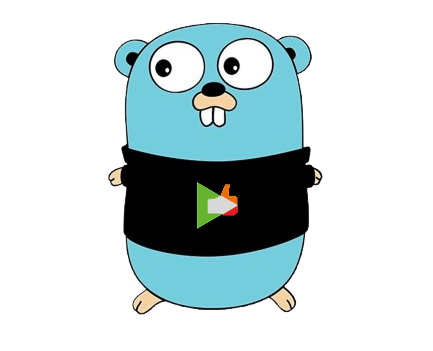
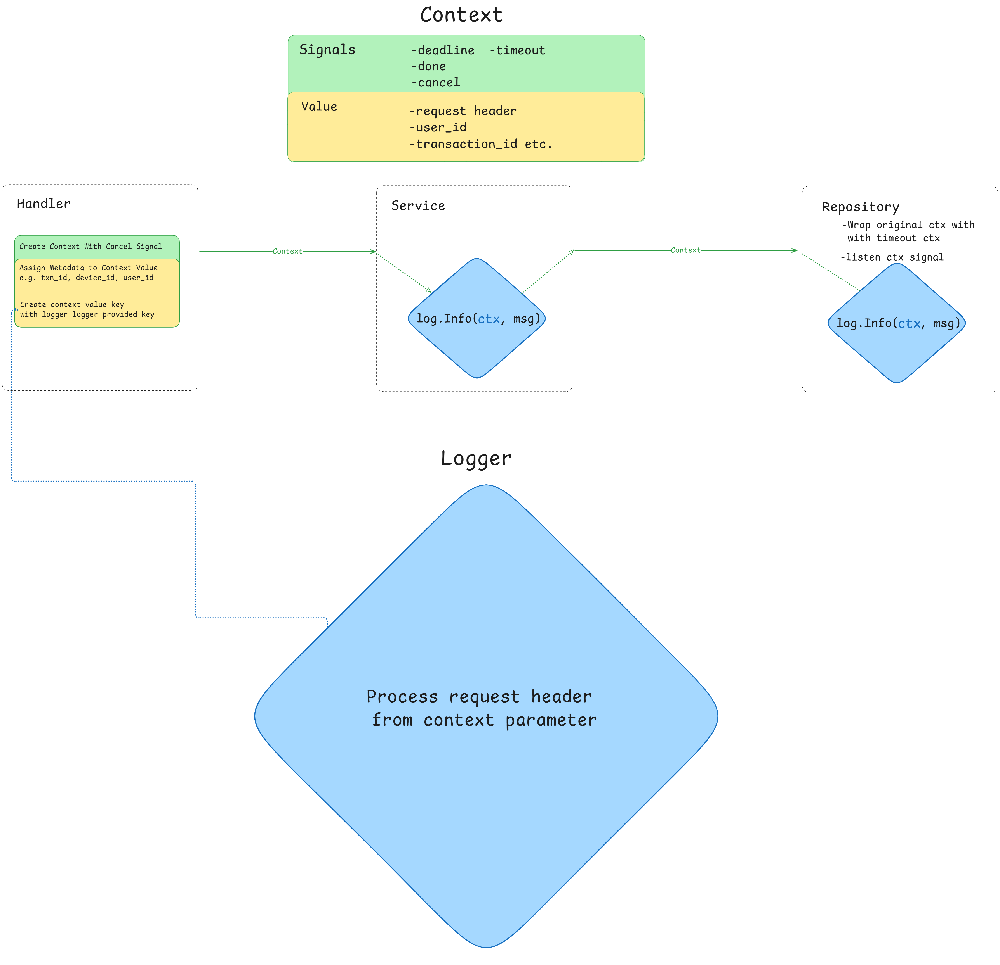

# EPIC Go Standard Library & Best Practice


Collection of Go libraries for [Epic-Consulting](https://www.epic-consulting.net/), Designed with "*Simplicity* and *Flexibility*" in mind.

## Quick Start
```bash
go get github.com/epicconsult/pkgep
```


> ## 🚧 Documentation is under construction! 🚧

## Table of Contents  
Libraries<br>
* [Logger](#logger)<br>
* [JWT](#jwt)<br>
* [File System](#file-system)<br>

Best practices<br> 
* [Use Context](#context)<br>
* [How to log 101](#how-to-log-efficiently)<br>
* [How to handle error](#error-handling)<br>

## Logger
> EpicLogger is a core interface that centralizes common logging functionality while offering great flexibility to be extended to support any logger client. <br>The design aligns with Go's philosophy of promoting simplicity without compromising power.

### Create Logger Instance.
```pkgep``` provides [*Logrus*](https://github.com/sirupsen/logrus) as the default logger client that fully implemeted **EpicLogger** interface. you can start using it right away like so.
```go
	// create logrus instance.
	logrus := logger.NewLogrus()

	// register logrus as your logger.
	logger.SetLogger(logrus)
```

#### Logrus *(Epic Logrus)* 
Logrus *(Epic Logrus)* provides "Functional Options Pattern" approach to tweak your logrus instance.
```go
	import (
		l "github.com/epicconsult/pkgep/logger"
	)
	// create logrus instance.
	logrus := l.NewLogrus(
		l.WithRotationType(l.Timestamp),
		l.WithAppName("my-api-app"),
		l.WithMaxSize(500), // max limit log file size in mb.
		l.WithMaxBackups(5),
	)

	// register logrus as your logger.
	logger.SetLogger(logrus)
```

#### Usage
Epic Logger is designed to handle metadata within a Context. Every method expects ```Context``` as the first argument. see [How to create Context for my app](#) for fully use Epic Logger at its finest.
```go
	// Epic Logger Interface
type LoggerEpic interface {
	Info(ctx context.Context, msg string, data ...any)
	Error(ctx context.Context, msg string, data ...any)
	Warn(ctx context.Context, msg string, data ...any)
	Trace(ctx context.Context, msg string, args ...any)

	InfoWithAction(ctx context.Context, action LogAction, msg string, data ...any)
}
```
> You can pass ```context.Background()``` as default argument to context.


## JWT

## File System


## Context
### What is context and why you should use it?
[What is context?](https://gobyexample.com/context)<br>
Why you should use it?<br>
This is an important question to answer. Context is the recommended way to pass data and signals throughout the lifecycle of your application. For an API server, it provides several benefits.

Context carries signals that are bound to specific events. These signals are useful in managing resources efficiently and ensuring proper execution flow.
### Use Case: Handling Client-Server Connection Termination
When a connection between a client and an API server is terminated, without a proper mechanism to notify the deeper layers of the application, those layers might continue executing their functions even though no client is waiting for a response.

This scenario leads to wasted time and resources, which is especially critical in cloud computing environments where costs are tied to resource usage.

Context helps solve this issue by propagating signals deep into the application, such as the database interaction layer. When the client disconnects, the repository layer receives a signal to terminate any ongoing operations, preventing unnecessary processing and saving resources. 



### How to create context to implement Epic Logger
You can initially create context in a Middleware right after JWT is decoded into go struct.
```go

	type ReqHeader struct {
		TransactionID string `json:"transaction_id"`
		Method        string `json:"method"`
		Path          string `json:"path"`
		JwtClaim
	}

	type JwtClaim struct {
		DeviceID string `json:"device_id"`
		UserID   int    `json:"user_id"`
	}

	func verifyJwtMiddleware() fiber.Handler {
	return func(c *fiber.Ctx) error {

		//mock: Verified jwt
		jwtClaim := JwtClaim{
			DeviceID: "fake-device-13455ef56535",
			UserID:   1,
		}

		reqHeader := ReqHeader{
			TransactionID: "fake-txnid-3453fdtjgLJj-e4dfd454tdgsdht",
			Method:        c.Method(),
			Path:          c.Path(),
			JwtClaim:      jwtClaim,
		}

		// Set context
		// init context with connection with client.
		connectionCtx, cancel := context.WithCancelCause(c.Context())
		defer cancel(nil) // terminate signal on client connection terminated.

		// Use Context Value Key provided by Epic Logger package.
		// The value can be any struct.
		valueCtx := context.WithValue(connectionCtx, logger.LogHeader, reqHeader)

		// (Optionally) set fiber locals
		c.Locals("logMetadata", reqHeader)

		// Set context (specific to Fiber)
		c.SetUserContext(valueCtx)

		return c.Next()
	}
}
```

## How to log (*efficiently*)

## Error handling